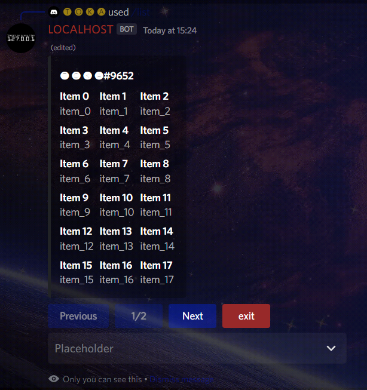
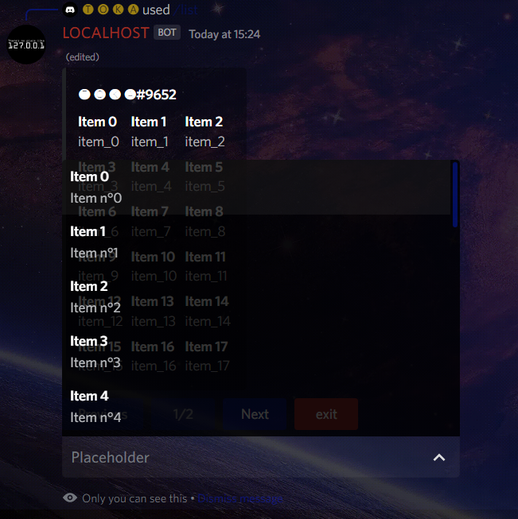

# ArrayToEmbed

## /!\ Pre-release, may have code breaking changes in the future updates

Manage a list of data into a multiple page embed

`embed.data.fields` and corresponding `selectMenu.options` are created on each page  
This allows users to see the displayed items and to select them with the menu underneath

## Example

### The fields



### The menu



### The code

```js
const {EmbedBuilder, ButtonStyle, ButtonBuilder, StringSelectMenuBuilder} = require('discord.js');

const {ArrayToEmbed} = require('@agmbk/array-to-embed');

const buttons = {
	previous: new ButtonBuilder()
		.setLabel( 'Previous' )
		.setCustomId( 'previous' )
		.setStyle( ButtonStyle.Primary ),
	current_page: new ButtonBuilder()
		.setLabel( 'current_page/total_page' )
		.setCustomId( 'current_page' )
		.setStyle( ButtonStyle.Secondary )
		.setDisabled( true ),
	next: new ButtonBuilder()
		.setLabel( 'Next' )
		.setCustomId( 'next' )
		.setStyle( ButtonStyle.Primary ),
	exit: new ButtonBuilder()
		.setLabel( 'exit' )
		.setCustomId( 'exit' )
		.setStyle( ButtonStyle.Danger ),
};

const arrayFields = [], arrayMenu = [];
for (let i = 0; i < 30; i++) {
	arrayFields.push( {label: `Item ${i}`, value: `item_${i}`} );
	arrayMenu.push( {label: `Item ${i}`, value: `item_${i}`, description: `Item n°${i}`} );
}

const selectMenu = new StringSelectMenuBuilder()
	.setCustomId('CustomId')
	.setPlaceholder( 'Placeholder' )
	.setOptions( [{label: 'bar', value: 'bar', description: 'bar'}, {
		label: 'foo',
		value: 'foo',
		description: 'foo',
	}] );

const embed = new EmbedBuilder().setAuthor( {name: '🅣 🅞 🅚 🅐#9652'} );

let arrayToEmbed = new ArrayToEmbed()
	.setEmbed( embed )
	.setFields( arrayFields )
	.setOptions( arrayMenu )
	.setSelectMenu( selectMenu )
	.setButtons( buttons )
	.setColumnCount( 3 )
	.setEphemeral( false )
	.setRowCount( 6 );

interaction.reply( arrayToEmbed.render() )
	.then( event => {
		const collector = event.createMessageComponentCollector( {time: 30 * 1e3} );
		
		collector.on( 'collect', async i => {
			if (interaction.user.id === i.user.id) {
				
				if (i.customId === buttons.previous.data.custom_id) {
					await event.interaction.editReply( arrayToEmbed.previous() );
				
				} else if (i.customId === buttons.next.data.custom_id) {
					await event.interaction.editReply( arrayToEmbed.next() );
				
				} else if (i.customId === buttons.exit.data.custom_id) {
					collector.stop( buttons.exit.data.custom_id );
				}
				await i.deferUpdate();
			}
		} );
		collector.on( 'end', (collected, reason) => {
			let message = {
				tts: false,
				content: null,
				embeds: [],
				components: [],
				files: [],
				ephemeral: true,
			};
			if (reason === buttons.exit.data.custom_id) {
				message.content = 'User exit';
			} else {
				message.content = 'Interaction has expired';
			}
			if (!interaction.ephemeral) {
				interaction.deleteReply();
				event.interaction.followUp( message );
			} else {
				interaction.editReply( message );
			}
		} );
		client.on( 'error', e => { console.error( e ); } );
	} );
```

# Contact : 🅣 🅞 🅚 🅐#9652

Questions, suggestions, feedbacks, bugs, improvements are welcome

## ToDo

- [x] ArrayToCanvas
- [ ] ArrayToCanvas possibility to stretch fit the field background image
- [ ] ArrayToCanvas crop the text fix
- [ ] countOnButton conserve label

Readme will be updated when finished  
